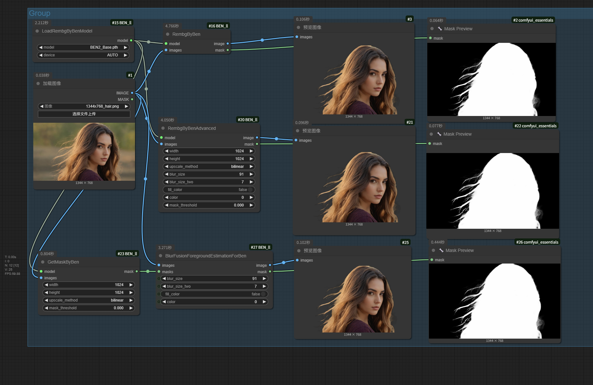

[中文文档](README_CN.md)

BEN is a deep learning model designed to automatically remove backgrounds from images, producing both a mask and a foreground image.

## Preview (Image embedded workflow)


## Install

- Manual
```shell
    cd custom_nodes
    git clone https://github.com/lldacing/ComfyUI_Ben_ll.git
    cd ComfyUI_Ben_ll
    pip install -r requirements.txt
    # restart ComfyUI
```
    

## Models
Download [BEN](https://huggingface.co/PramaLLC/BEN/resolve/main/BEN_Base.pth?download=true) or [BEN2](https://huggingface.co/PramaLLC/BEN2/resolve/main/BEN2_Base.pth?download=true) from HuggingFace and put it in `ComfyUI/models/rembg/ben/`


## Thanks

Original Project [BEN](https://huggingface.co/PramaLLC/BEN)


